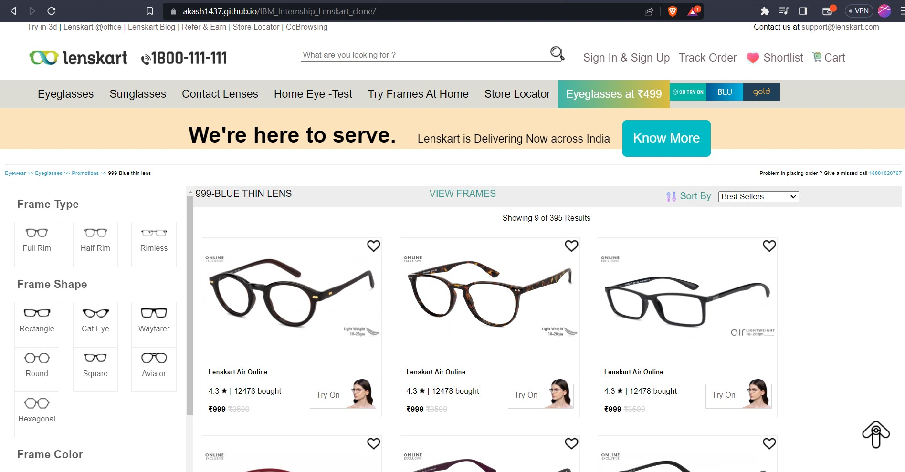

## IBM_Internship_Lenskart_clone_23
 <h2>This is my Cloned website link:</h2>
<h1>https://akash1437.github.io/IBM_Internship_Lenskart_clone/</h1>

The Lenskart Website Clone project seeks to recreate the successful online eyewear platform, Lenskart. It aims to replicate Lenskart's user-friendly interface, extensive product catalog, personalized shopping experience, and convenient services. By cloning the website, users can enjoy a seamless platform for browsing and purchasing eyewear products. Key features such as virtual try-on, home trial service, and a wide range of eyewear options will be included. The clone prioritizes affordability, quality, and convenience, providing an accessible solution to traditional stores. With a focus on user satisfaction and innovation, the Lenskart Website Clone aims to enhance the online eyewear shopping experience.

 

